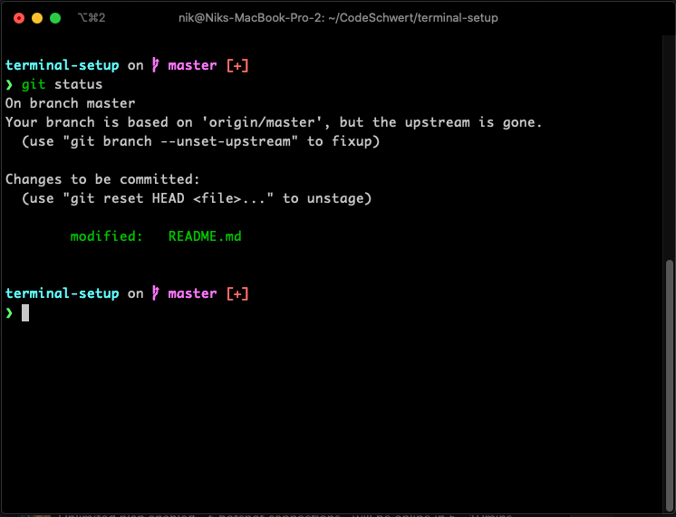

# Terminal Setup

Steps for getting a customizable terminal config.

1. Install [Homebrew](https://brew.sh/) package manager for MacOS.

2. Install [iTerm2](https://iterm2.com/) terminal emulator.

3. Install [Starship](https://starship.rs/guide/#with-homebrew) cross-shell prompt.

4. Install [Oh My Zsh](https://github.com/ohmyzsh/ohmyzsh#basic-installation), a  community-driven framework for managing your zsh configuration.

5. Install [zsh-syntax-highlighting](https://github.com/zsh-users/zsh-syntax-highlighting/blob/master/INSTALL.md#oh-my-zsh) to enable syntax highlighting in the terminal.

6. Edit the `.zshrc` config file to enable the installed prompts and plugins.

    - Open the terminal.
    - Open the `.zshrc` config file in a text editor:

      - ```shell
        vim ~/.zshrc
        ```

    - Now find the line starting with `ZSH_THEME=` and comment the line out by adding a `#` at the start of the line.

      - ```shell
        # example config
        # ZSH_THEME="robbyrussell"
        ```

    - Then enable the `zsh-syntax-highlighting` plugin. Find the `plugin` directive in the config file and add `zsh-syntax-highlighting` to the end of the list of plugins:

      - ```shell
        # Note, the 'zsh-syntax-highlight' plugin
        # "NEEDS" to go at the end of the the list 
        plugins=(git brew npm zsh-syntax-highlighting)
        ```
      - See this [FAQ for why the zsh-syntax-highlight plugin needs to go last](https://github.com/zsh-users/zsh-syntax-highlighting#why-must-zsh-syntax-highlightingzsh-be-sourced-at-the-end-of-the-zshrc-file).

    - Finally enable the `Starship` prompt:

      - Scroll to the end of the config and paste the following:

      - ```shell
        eval "$(starship init zsh)"
        ```

      - Save config file.

7. Install `Powerline` symbols/fonts for the `Starship` prompt.

    - Download the `PowerlineSymbols.otf` font pack from Github: https://github.com/powerline/powerline/tree/develop/font

    - Double click / open the downloaded font pack. This will open a `Font Book` window.

      - Click on the `Install font` button to install the font onto your system.

    - Update the iTerm preferences to use the `Powerline` fonts.

      - Switch to an iTerm window and click on the `iTerm2` menu item in the top left corner of the screen. Then select `Preferences`. Or use the shortcut keys `command` + `,`

      - In the `Preferences` window, switch to the `Profiles` tab (in the top of the Preferences window).

      - Select a profile (if not using the `Default` profile).

      - Select the `Text` tab on the right section.

      - Find and check the option `Use a different font form non-ASCII text`. This should now display the `Non-ASCII Font` section under the checkbox.

      - In the `Non-ASCII Font` section, click the font selection box and select `PowerlineSymbols`.

8. Restart the terminal or import the new settings:

    - ```shell
      source ~/.zshrc
      ```

Now you should have a terminal that looks something like this:


